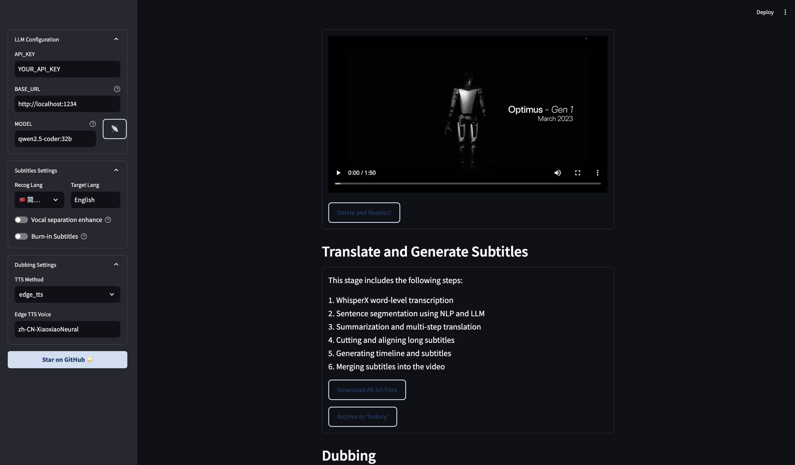

- [**Videolingo: 开源免费的视频字幕提取和配音软件**](#videolingo-开源免费的视频字幕提取和配音软件)
  - [它是什么？能干什么？](#它是什么能干什么)
  - [它的特点和功能(官网描述)](#它的特点和功能官网描述)
  - [个人观点](#个人观点)
  - [如何配置本地运行](#如何配置本地运行)

# **Videolingo: 开源免费的视频字幕提取和配音软件**

## 它是什么？能干什么？

VideoLingo 是一站式视频翻译本地化配音工具，能够一键生成 Netflix 级别的高质量字幕，告别生硬机翻，告别多行字幕，还能加上高质量的克隆配音，让全世界的知识能够跨越语言的障碍共享。


## 它的特点和功能(官网描述)

- 🎥 使用 yt-dlp 从 Youtube 链接下载视频
- **🎙️ 使用 WhisperX 进行单词级和低幻觉字幕识别**
- **📝 使用 NLP 和 AI 进行字幕分割**
- **📚 自定义 + AI 生成术语库，保证翻译连贯性**
- **🔄 三步直译、反思、意译，实现影视级翻译质量**
- **✅ 按照 Netflix 标准检查单行长度，绝无双行字幕**
- **🗣️ 支持 GPT-SoVITS、Azure、OpenAI 等多种配音方案**
- 🚀 整合包一键启动，在 streamlit 中一键出片
- 📝 详细记录每步操作日志，支持随时中断和恢复进度
- **输入语言支持：**🇺🇸 英语 🤩 | 🇷🇺 俄语 😊 | 🇫🇷 法语 🤩 | 🇩🇪 德语 🤩 | 🇮🇹 意大利语 🤩 | 🇪🇸 西班牙语 🤩 | 🇯🇵 日语 😐 | 🇨🇳 中文* 😊


## 个人观点

- 亲测：视频字幕提取和配音非常精准

- 懒得折腾的话，可直接使用付费SaaS套餐，省时间，费用也很低，还有免费翻译 15 分钟视频

  

- 上手快，操作简单[VideoLingo操作文档](https://docs.videolingo.io/docs/start)

- 🤩可支持完全的本地化Locally部署，使用本地LLM模型，费用直接降至0🤩

- 🤩使用本地化Locally 配音软件GPT-SoVITS🤩


## 如何配置本地运行

- 本地安装

  `git Clone the repository`

```
git clone https://github.com/Huanshere/VideoLingo.git
cd VideoLingo
```

​	`Install dependencies`(requires `python=3.10`)

```
conda create -n videolingo python=3.10.0 -y
conda activate videolingo
python install.py
```

​	`Start the application`

```
streamlit run st.py
```

之后会默认打开一个页面：http://localhost:8501/ or http://localhost:8502/




- 选择完全本地化体验，使用 `qwen2.5-coder:32b (linux或者window)` 或 `lmstudio-community/Qwen2.5-Coder-32B-Instruct-MLX-4bit (MacOS)` 作为大模型，Edge TTS 作为配音，无需任何 API key（此时需要在 `VideoLingo/config.yaml` 中将 `max_workers` 设为 1，`summary_length` 调低至 2000）。

```yaml
# * Summary length, set low to 2k if using local LLM
summary_length: 2000

# *Number of LLM multi-threaded accesses, set to 1 if using local LLM
max_workers: 1
```

- 使用LM studio加载下载好的模型 `lmstudio-community/Qwen2.5-Coder-32B-Instruct-MLX-4bit` 

  > 但处理过程涉及多步思维链和复杂的json格式，**不建议使用小于 30B 的模型**。

[下载安装LM studio请参考这里](https://mesevenjourney.github.io/posts/ai/finetuning_with_mlx_and_using_lm_studio#lm-studio%E5%8A%A0%E8%BD%BD%E6%A8%A1%E5%9E%8B)


